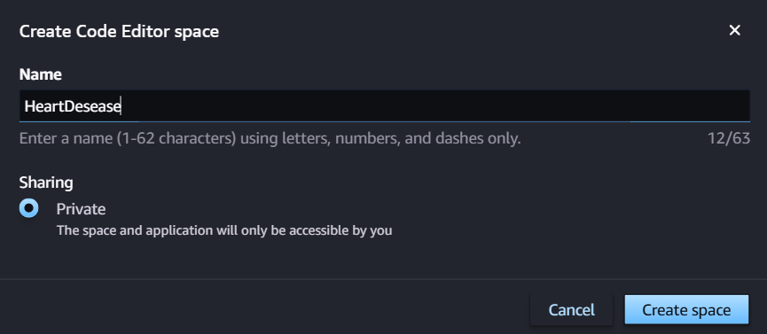
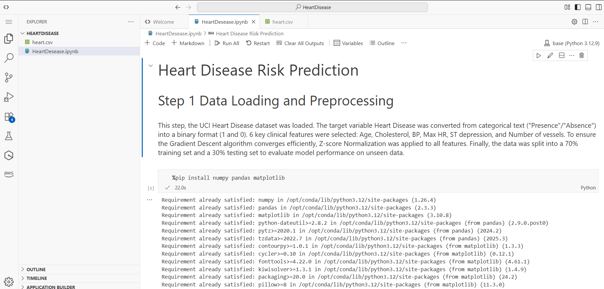

# Heart Disease Risk Prediction: Logistic Regression
Juan Sebastian Velandia

This repository contains an end-to-end implementation of a binary classifier designed to predict the presence of heart disease using clinical patient data. The project emphasizes the transition from mathematical foundations to production-ready cloud deployment.

## Context
Heart disease remains the leading cause of death globally, claiming approximately 18 million lives annually. In the context of Enterprise Architecture, integrating predictive analytics into healthcare systems allows for early identification of at-risk patients and optimized resource allocation. This project implements Logistic Regression from first principles to identify risk factors using the UCI Heart Disease Dataset.

# Project Stages
## 1. Data Engineering & EDA
Dataset: UCI Heart Disease Repository (303 patients, 14 clinical features).

Preprocessing: Target binarization ("Presence" vs. "Absence"), 70/30 stratified split, and Z-score normalization of numerical features.

Feature Selection: Analysis focused on 6 key predictors: Age, Cholesterol, Blood Pressure (BP), Max HR, ST Depression, and Number of Vessels.

## 2. Algorithmic Implementation (from scratch)
Mathematical Core: Explicit definition of the Sigmoid function, Binary Cross-Entropy loss, and Vectorized Gradient Descent.

Optimization: Training conducted with α=0.1 over 1,500+ iterations to ensure cost convergence.

Evaluation: Measurement of Accuracy, Precision, Recall, and F1-score on unseen test data.

## 3. Visualization & Regularization
Decision Boundaries: 2D plotting of feature pairs (e.g., Age vs. Cholesterol) to visualize the classifier's linear separation.

L2 Regularization: Implementation of weight penalties ( 
2m
λ
​
 ∣∣w∣∣ 
2
 ) to mitigate overfitting and improve model robustness.

Hyperparameter Tuning: Comparative analysis of λ values ([0, 0.001, 0.01, 0.1, 1]) to identify the optimal balance between bias and variance.

## Sage maker

First we open Sagemaker studio

Then we open the code editor section

And we select create code space 

The next step is run the space and open the code editor

Now we create a new directory

And for last we copy the notebook and select run all, for chechk the correct running
